

<strong>
#Homework 5 Theory
###Joseph Mulray
####Febuary 13, 2017

</strong>
 
 

###Problem 5.1:
>Draw all the possibilities for a binary search tree containing the four elements 1, 2, 3, 4.

The amount of searches in a binary search tree is log(n). A binary search tree containing 4 elements will have a maximum 2 searches and a best case of 1. 

All possibilites of BST Four Elements:  
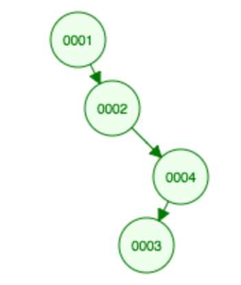
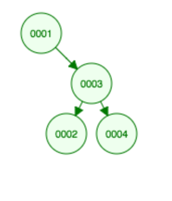
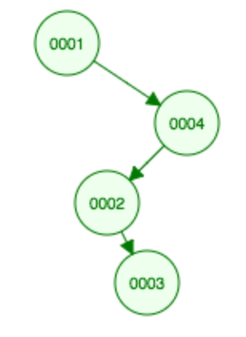
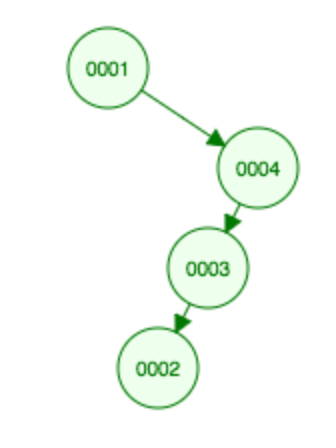
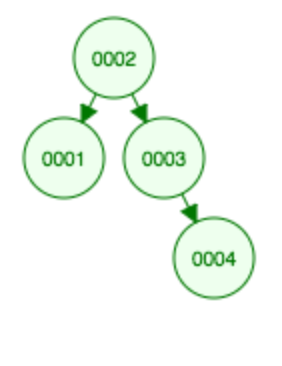
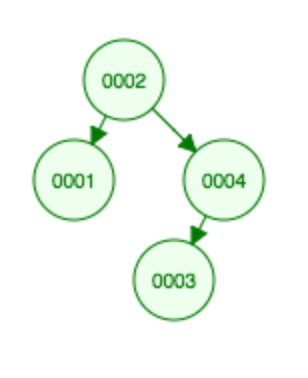
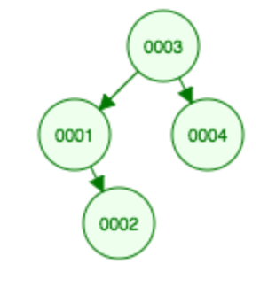
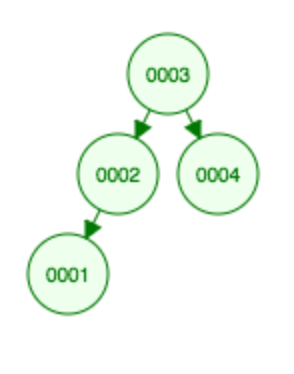
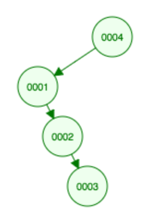
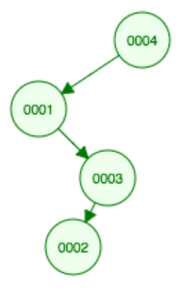
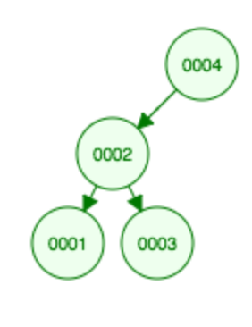
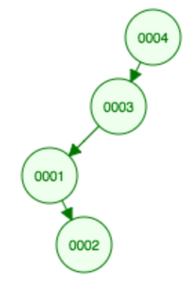
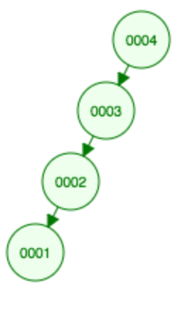

 
 

###Problem 5.2:
>Insert the integers 7, 2, 9, 0, 5, 6, 8, 1 into a binary search tree by repeated application of the procedure INSERT of Fig. 5.3.

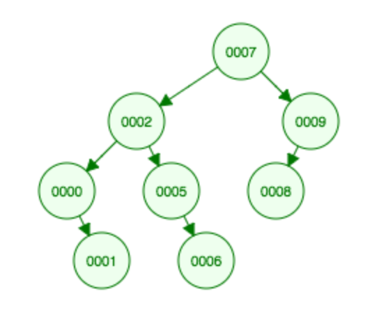

 
 

###Problem 5.3:
>Show the result of deleting 7, then 2 from the final tree of Exercise 5.2.

1. Remove 7 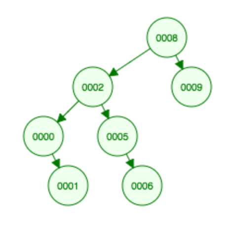
 
2. Remove 2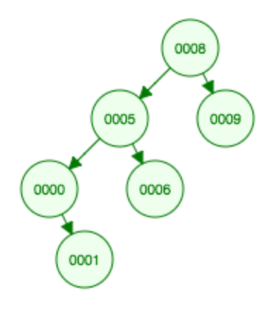

 
 

###Problem 5.4:
No the order in which elements of a binary search tree are deleted does not matter, and will not affect the final order of the tree. The node deleted will always have a successor to that node, filling the tree.
 
 

###Problem 5:
>Provide your observed behavior of the make_heap() alorithm.

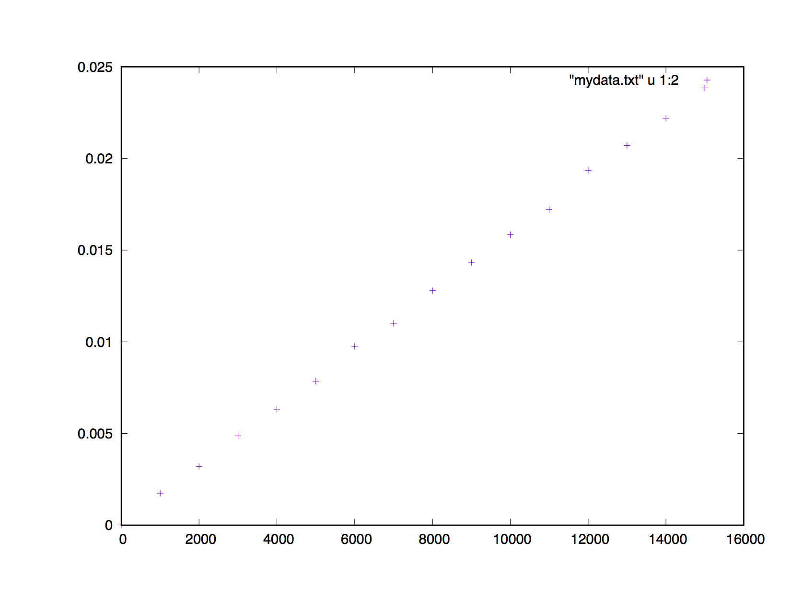

Plotted the data using gnuplot, and you can see a clear linear trend with an increase in n elements for the make_heap() algorithm, having make_heap O(n). 

 
 

###Problem 6:
>How does this compare to merge sort (O(n lg n) time and O(n) space)?

Creating a heap will still be linear O(n) for a way of sorting numbers.  Since each element is the least element left on the heap when you pop it off the heap, the numbers popped off need to be in order so this will run O(nlogn) for n, which is each downheap. The space complexity will also remain to be O(n).

###Problem 7:
>Describe an algorithm that uses first and next, the above structure definition, and the function impressive_A() to fill in the computed value members. Analyze the time and space complexity of your algorithm, including the fact that your algorithm must call impressive_A().

Didnt Complete.

###Problem 8:
> Design a queue using only two stacks. What is the time complexity for insert? For remove()? What is the space complexity?

Using two stacks to design a queue, would create one for adding a new element to the stack, call it stack1. Then pop each element from stack1 to stack2, which will reverse the order. Insert and to create the stack will be constant time, and removing an element will be O(n). 
###Problem 9:
Would have the two list of blocks A, and B and if , and there is no possibility of a match on a server, then the file from the server would get stored in an array, or buffer, to which the contents 512-byte block would be accessable in constant time operations. The file could then be copied over if and only if the server file does not match the file stored locally, if that was so this would just be a waste of time,. 

 
 