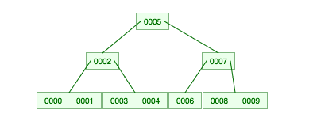
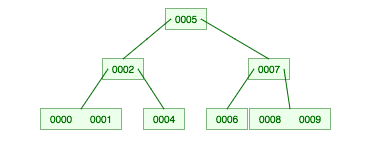

<strong>
#Homework 6 Theory
###Joseph Mulray
####Febuary 20, 2017

</strong>
 
 

###Problem 5.7:
>Show the 2-3 tree that results if we insert into an empty set, represented
as a 2-3 tree, the elements 5, 2, 7, 0, 3, 4, 6, 1, 8, 9:

 
 

###Problem 5.8:

>Show the result of deleting 3 from the 2-3 tree that results from Exercise 5.7:

