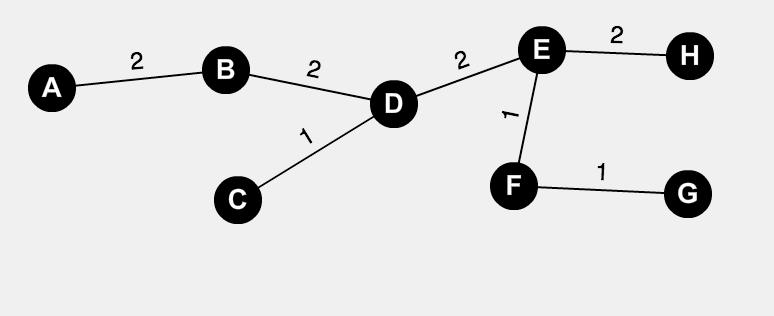
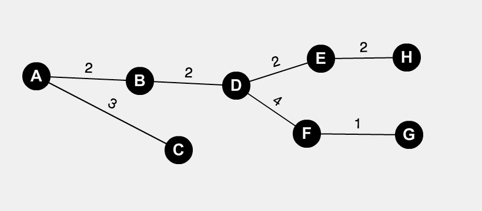
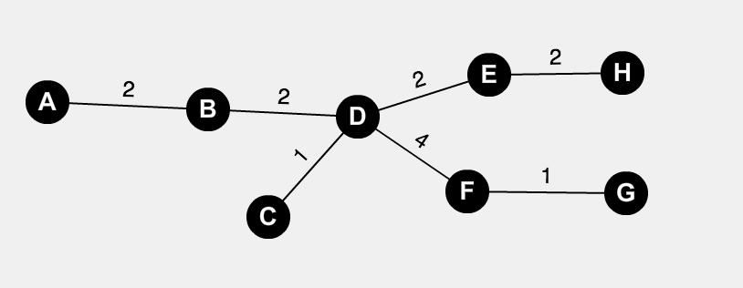

<center>
<strong>
#Homework 8 Theory
###Joseph Mulray
####March 6, 2017
</center>

</strong>
<br/>
<br/>


###Problem 6.6:
>Show that the program Dijkstra does not work correctly if arc costs can
be negative.


The algorithm Dikstra does not work correctly if the costs of paths to each node can be negative. with a large negative arc, it would continue to loop around the nodes and edges getting a lower and lower value for each cycle continuing infinite times. Dikstra is a greedy algorithm making negative arc costs causing the program to not work correctly.
</br>
</br>

###Problem 7.1
>Describe an algorithm to insert and delete edges in the adjacency list
7.1 representation for an undirected graph. Remember that an edge (i, j)
appears on the adjacency list for both vertex i and vertex j.

</br>

```
G = Graph
i, j = vertex

#This is assuming that the graph has already been build in a list or dict.

def addEdge(G, i, j)

	#check if edge already exist or not
	if G[i][j]:
		
		#undirected graph do for both positions
		G[i] = {}
		G[j] = {}
	else:
		G[i][j] = {}
		G[j][i] = {}
	

def deleteEdge(G, startV, j):
	if G[i][j] not None:
	
	#reset values of existing
		G[i][j] = None
		G[j][i] = None
				
```
</br>

###Problem 7.2
>Write an algorithm to delete the first edge at a vertex using your
new representation. Hint. How do you arrange that the two cells representing edge (i, j) can be found quickly from one another?

```
G = graph
e = edge

#Assume that edge is already a position in Graph

def addEdge(G, e):
	if e not in G:
	
		#insert to front of graph
		G.insert(e)
 

def deleteEdge(G, e):
	if e in G:
		G.remove(e)
		
```
</br>

###Problem 7.3

> a.  Find a minimum-cost spanning tree by Prim's algorithm.

<center>



</center>
</br>

> b. Find a minimum-cost spanning tree by Kruskal's algorithm.


<center>

</center>
</br>

> d. Find a breadth-first spanning tree starting at a and at d.

<center>

</br>
</br>



</center>
