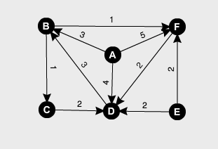
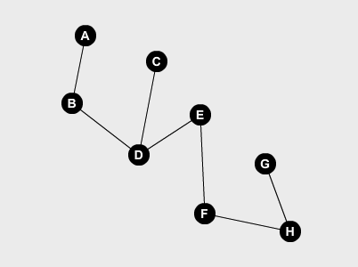
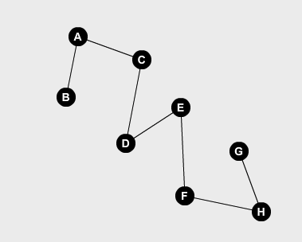

<center>
<strong>
#Homework 9 Theory
###Joseph Mulray
####March 13, 2017
</center>

</strong>
<br/>
<br/>


###Problem 6.2:
>Describe a mathematical model for the following scheduling problem. Given tasks T1, T2, . . . , Tn, which require times t1, t2, . . . , tn to
complete, and a set of constraints, each of the form "Ti must be completed prior to the start of Tj," find the minimum time necessary to complete all tasks.

In this scenario to represent a task $$T(n)$$ which reuires times $$t(n)$$ can be represented by vertices in a directed graph and constraints as edges. Then a topoligical sort can then be due to the constraints of $$T(i)$$ being completed prior to the start of $$T(j)$$. Now the graph will be in order to which each edge will be the time to complete the tasks. With each edge we can then keep track of the longest path to each outgoing vertex. This path is then the shortest path necessary to complete all tasks in the least amount of time.


<br/>
<br/>
###Problem 6.8:
>Assuming the order of the vertices is a, b , . . . , f in Fig. 6.38, construct a depth-first spanning forest; indicate the tree, forward, back and cross arcs, and indicate the depth-first numbering of the vertices.

<center>


<br/>

| FORWARD  | BACK  |  CROSS | TREE |
|:-:|---|---|---|
| a -> d |  d -> b |  e -> f | a -> b |
| a -> f  |   |  e -> d | b -> f |
|   |   |  f -> d | b -> c |
|	|	|	| c -> d	|

</center>


<br/>
<br/>
###Problem 6.10:
>A root of a dag is a vertex r such that every vertex of the dag can be reached by a directed path from r. Write a program to determine whether a dag is rooted.

For each node if there is an edge from a to b, then in order for c to be rooted no edges from a to c.

```
G = Graph
N = number of vertices 

def isRoot(G, N):
	isRoot = []
	for vertice in N:
		for edge in N:
			if G[vertice][edge] > 0:
		isRoot.append(node)
		
	
	if isRoot not None:
		return True
	else
		return False
	
```


<br/>
<br/>
###Problem 6.14:
>Write a program to find the longest path in a dag. What is the time complexity of your program?

```
G = Graph
N = number of vertices

def longest(G, N):
	path = [0 for node in N]
	
	#topological sort Graph
	TS(G)
	
	for vertice in G:
		#for each adjacent vertice
		for v in ADJ(vertice):
			if path[vertice] < path[v] + path[v][weight]:
				path[vertice] = path[v] + path[v][weight]
		
```

Time complexity of this program is $$O(V+E)$$ by the cost of a topological sort and by cycling through each vertice and adjacent vertices will still be bound by $$(V+E)$$ .

<br/>
<br/>
###Problem 6.15:
>Find the strong components of Fig. 6.38.

Strong components of Figure 6.38 are the following:

{a} {e} {b, c, d, f}


<br/>
<br/>
###Problem 6.20:
>Write a program that takes as input a digraph and two of its vertices. The program is to print all simple paths from one vertex to the other. What is the time complexity of your program?


```
def printPath(G, v, w):
	
	queue = []
	
	for v in G:
		queue.append(v)
	
	while queue is not None:
		while w is not 0:
			current = queue.pop()
			v = w
			w = current
			queue.append(v)
		#print path for each vertice
		print queue

```

The time complexity of this program is $$O(E)$$, it basically is the same as BFS cycling through each vertex and getting each edge and printing the total path once every vertex has been visited.


<br/>
<br/>
###Problem 7.3 c:
>c. Find a depth-first spanning tree starting at a and at d.

Starting at a:
<center>

</center>

Starting at d:
<center>


</center>
